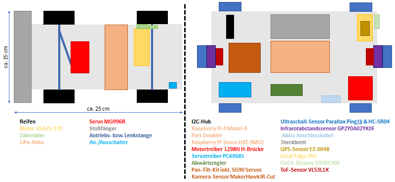
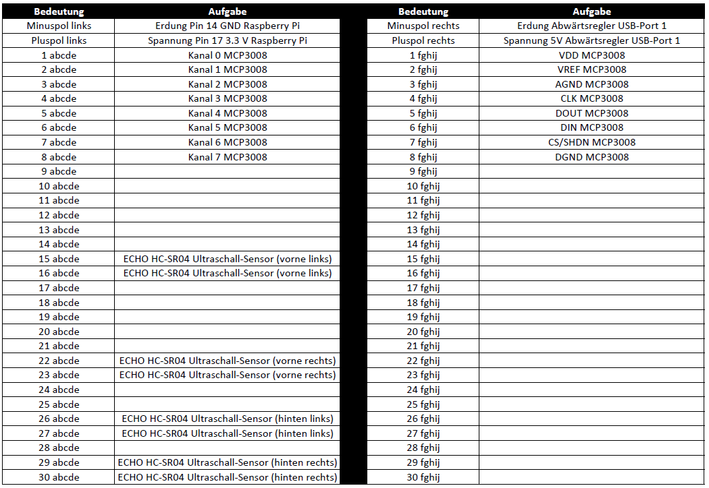

# robotcar

## Develop and test Advanced Driver Assistance Systems (ADAS) with the robotcar using Python, ROS, OpenCV and TensorFlow


## 1 Project Information
=====================

Project of the [Faculty of Computer Science](https://www.hs-furtwangen.de/en/faculties/computer-science/) of the [Furtwangen University](https://www.hs-furtwangen.de/en/) inside the master degree [Mobile Systems](https://www.hs-furtwangen.de/en/programmes/mobile-systems-master/).

Part of the master thesis "Entwicklung einer erweiterbaren Simulationsplattform für Fahrerassistenzfunktionen am Beispiel von Python, ROS, OpenCV und TensorFlow"

Developer: Michael Christian Dörflinger

Supervisiors:

- [Prof. Dr. Steffen Thiel](https://www.hs-furtwangen.de/personen/profil/75-steffenthiel/)
- [Ingo Maindorfer](https://www.hs-furtwangen.de/personen/profil/1707-ingomaindorfer/)

The development of driver assistance functions is extensive and expensive. Virtual simulations significantly improve the development process, but do not reflect the reality of vehicle actuators and sensors. Development under physically real conditions is therefore indispensable. The thesis will investigate how such a simulation platform can be implemented using a small robot car, taking into account the expandability of new sensor technology and driver assistance functions.

## 2 Hardware
=====================



(Not the actual used components because you can get it cheaper.)

| Quantity | Modul | Article | Estimated price (per piece) |
|--------- | ------| --------| ----------------------------|
| 1 | chassis | [4WD RC Smart Car Chassis](https://www.elecrow.com/4wd-smart-car-robot-chassis-for-arduino-servo-steering.html) | 40,00€ |
| 1 | chassis | [20x20 cm perforated plate](https://smile.amazon.de/dp/B00QAGIXLG/ref=pe_3044161_185740101_TE_item) | 2,50€ |
| 1 | chassis | [mounting kit raspberry pi](https://www.amazon.de/gp/product/B07G5HM9ZT/ref=ppx_yo_dt_b_asin_title_o04_s00?ie=UTF8&psc=1) | 12,00€ |
| 1 | onboard computer | [Raspberry Pi 4 Model B](https://www.raspberrypi.org/products/raspberry-pi-4-model-b/?resellerType=home&variant=raspberry-pi-4-model-b-8gb) | 77,50€ |
| 1 | onboard computer | [Raspberry Pi cooler](https://www.amazon.de/gp/product/B07JGNF5F8/ref=ppx_yo_dt_b_asin_title_o06_s00?ie=UTF8&psc=1) | 8,99€ |
| 1 | onboard computer | [Raspberry Pi stacking header](https://www.amazon.de/gp/product/B07NTH2RZX/ref=ppx_yo_dt_b_asin_title_o08_s00?ie=UTF8&psc=1) | 10,35€ |
| 1 | onboard computer | [Raspberry Pi port doubler](https://www.amazon.de/gp/product/B07GPPZ7TB/ref=ppx_yo_dt_b_asin_title_o05_s00?ie=UTF8&psc=1) | 7,23€ |
| 1 | co-processor | [Coral Edge TPU USB accelerator](https://www.mouser.de/ProductDetail/Coral/G950-06809-01?qs=u16ybLDytRbcxxqFKdbhgQ%3D%3D&vip=1&gclid=CjwKCAiA7939BRBMEiwA-hX5J7SCRvcS0FLpI7EGL1z0iKYdMWKdEDGNVP10fhpuVj-wnjDSk8_xyRoCXKIQAvD_BwE) | 74,50€ |
| 1 | storage medium | [tf card class 10 64gb](https://www.amazon.de/Intenso-Micro-Class-Speicherkarte-SD-Adapter/dp/B00FMB9A30/ref=sr_1_4?__mk_de_DE=%C3%85M%C3%85%C5%BD%C3%95%C3%91&dchild=1&keywords=tf%2Bclass%2B10%2B64gb&qid=1605913236&quartzVehicle=1522-1061&replacementKeywords=class%2B10%2B64gb&sr=8-4&th=1) | 5,99€ |
| 1 | motor controller | [L298N H-Bridge](https://www.amazon.de/Br%C3%BCcke-Treiberplatine-Schrittmotor-Stepper-Controller/dp/B07PRXMH9P/ref=sr_1_2_sspa?__mk_de_DE=%C3%85M%C3%85%C5%BD%C3%95%C3%91&dchild=1&keywords=L298N&qid=1605913516&s=ce-de&sr=1-2-spons&psc=1&spLa=ZW5jcnlwdGVkUXVhbGlmaWVyPUExQzdOVkYyQlJDM1EwJmVuY3J5cHRlZElkPUEwNjUyNTU5MlRVSjJPR0cyQVEwVyZlbmNyeXB0ZWRBZElkPUEwMTkwMzM0NlEwSlQzMFc1QU00JndpZGdldE5hbWU9c3BfYXRmJmFjdGlvbj1jbGlja1JlZGlyZWN0JmRvTm90TG9nQ2xpY2s9dHJ1ZQ==) | 5,89€ |
| 1 | servo controller | [PCA9685 16 Channel Servo Controller](https://www.amazon.de/gp/product/B06XSFFXQY/ref=ppx_yo_dt_b_asin_title_o07_s00?ie=UTF8&psc=1) | 6,89€ |
| 1 | step down converter | [Dual USB 9V/12V/24V/36V to 5V Converter DC-DC 3A Step Down Power Module](https://www.amazon.de/dp/B0768D2NYH?tag=ingmstap-21&linkCode=ogi&th=1&psc=1) | 8,26€ |
| x | battery | [11.1 V LiPo](https://www.amazon.de/Lipo-11-1800mAh-25C-3S-1P/dp/B009H497IG/ref=sr_1_2?__mk_de_DE=%C3%85M%C3%85%C5%BD%C3%95%C3%91&dchild=1&keywords=lipo+11.1v+1800mAh+25c&qid=1605912549&sr=8-2) | 27,19€ |
| 1 | power supply unit | [universal power supply unit](https://www.reichelt.de/de/de/universal-schaltnetzteil-36-w-5-15-v-3000-ma-mw-3h36gs-p89789.html?r=1) | 13,20€ |
| 1 | power supply unit | [Deans T plug](https://www.amazon.de/gp/product/B07FND44XC/ref=ppx_yo_dt_b_asin_title_o07_s01?ie=UTF8&psc=1) | 10,80€ |
| 1 | power supply unit | [dc female terminal block adapter](https://www.amazon.de/gp/product/B00E8CURKO/ref=ppx_yo_dt_b_asin_title_o07_s01?ie=UTF8&psc=1) | 2,00€ |
| 1 | camera | [MakerHawk Raspberry Pi camera IR Fisheye wide angle 150-160 degrees 5MP OV5647](https://www.amazon.de/gp/product/B07DRH5Y5S/ref=ppx_yo_dt_b_asin_title_o07_s00?ie=UTF8&psc=1) | 27,99 |
| 1 | camera | [pan-tilt-bracket](https://www.amazon.de/dp/B079H3WY7T?tag=ingmstap-21&linkCode=ogi&th=1&psc=1) |  |
| 1 | camera | [passive cooler](https://www.amazon.de/gp/product/B06XWFG7Q7/ref=ppx_yo_dt_b_asin_title_o06_s00?ie=UTF8&psc=1) | 3,99€ |
| 1 | camera | [flat ribbon cable](https://www.amazon.de/gp/product/B075PBTQPG/ref=ppx_yo_dt_b_asin_title_o05_s00?ie=UTF8&psc=1) | 5,29€ |
| 1 | imu | [Raspberry Pi Sense HAT](https://www.amazon.de/dp/B014T2IHQ8/ref=dp_prsubs_1) | 37,63€ |
| 2 | time-of-flight | [VL53L1X](https://www.amazon.de/gp/product/B07DM2TKKL/ref=ppx_yo_dt_b_asin_title_o06_s00?ie=UTF8&psc=1) | 17,65€ |
| 2 | ultrasonic | [Parallax Ping)))](https://www.amazon.de/Parallax-Ping-Ultrasonic-Distance-Sensor/dp/B004SRTM0K/ref=sr_1_1?__mk_de_DE=%C3%85M%C3%85%C5%BD%C3%95%C3%91&dchild=1&keywords=parallax+ultrasonic&qid=1605913993&sr=8-1) | 39,00€ |
| 4 | ultrasonic | [HC-SR04](https://www.amazon.de/gp/product/B07KPJNLSS/ref=ppx_yo_dt_b_asin_title_o01_s00?ie=UTF8&psc=1) | 8,00€ |
| 1 | ultrasonic | [330 Ohm resistor](https://www.amazon.de/gp/product/B00YW3E2LO/ref=ppx_yo_dt_b_asin_title_o01_s00?ie=UTF8&psc=1) | 6,37€ |
| 1 | ultrasonic | [470 Ohm resistor](https://www.amazon.de/gp/product/B00YW4DTRG/ref=ppx_yo_dt_b_asin_title_o01_s00?ie=UTF8&psc=1) | 6,49€ |
| 2 | infrared | [GP2Y0A02YK0F](https://www.amazon.de/SENSOR-DISTANCE-ANALOGUE-GP2Y0A02YK0F-SHARP/dp/B018COQRAC/ref=sr_1_1?__mk_de_DE=%C3%85M%C3%85%C5%BD%C3%95%C3%91&dchild=1&keywords=GP2Y0A02YK0F+sharp&qid=1605987062&s=ce-de&sr=1-1) | 12,28€ |
| 1 | infrared | [breadboard](https://www.pollin.de/p/acrylplatte-und-breadboard-fuer-rpi-b-2b-3b-3b-810982) | 4,50€ |
| 1 | infrared | [MCP3008 A/D-Converter](https://de.rs-online.com/web/p/a-d-wandler/6696064/) | 2,00€ |
| 1 | gps | [EZ-0048 GPS-Modul](https://www.amazon.de/USB-USB-Port-GPS-Modul-Raspberry-EZ-0048/dp/B07L9VZFZD) | 38,50€ |
| 1 | i2c | [6 Port Grove I2C-Hub](https://www.robotshop.com/de/de/grove-i2c-hub-6-port.html?gclid=Cj0KCQiAkuP9BRCkARIsAKGLE8XOw5ILNanURA4TTg_egSyDX-QGtdQO4QljIMgeD9OuXtUTQ8oGYEcaAlaxEALw_wcB) | 1,47€ |
| 1 | display | [I2C OLED 128 x 64 Pixel 0,96 Zoll](https://www.amazon.de/gp/product/B074N9VLZX/ref=ppx_yo_dt_b_asin_title_o09_s00?ie=UTF8&psc=1) | 11,99€ |
| 1 | wire | [jump wires (F2F, F2M and M2M)](https://www.amazon.de/AZDelivery-Jumper-Arduino-Raspberry-Breadboard/dp/B07KFPXN44/ref=sr_1_2_sspa?__mk_de_DE=%C3%85M%C3%85%C5%BD%C3%95%C3%91&crid=S8CEKQOZL6A6&dchild=1&keywords=jumper+kabel&qid=1605986389&quartzVehicle=21-720&replacementKeywords=kabel&sprefix=jumper+kabe%2Caps%2C203&sr=8-2-spons&psc=1&spLa=ZW5jcnlwdGVkUXVhbGlmaWVyPUEzVEJWNUhUMUg3SEg2JmVuY3J5cHRlZElkPUEwNzYxNDk3Mk9FWUJJUzRZTlZGViZlbmNyeXB0ZWRBZElkPUEwNzgzODI4SVpUNFRZUzVWTTQ5JndpZGdldE5hbWU9c3BfYXRmJmFjdGlvbj1jbGlja1JlZGlyZWN0JmRvTm90TG9nQ2xpY2s9dHJ1ZQ==) | 4,66€ |
| 1 | wire | [4 Pin Female Jumper to Grove](https://www.amazon.de/dp/B01AD62W56?tag=ingmstap-21&linkCode=ogi&th=1&psc=1) | 7,90€ |
| 1 | wire | [usb litz wire](https://www.reichelt.de/usb-2-0-kabel-a-stecker-auf-2x-offene-kabelenden-delock-85250-p203116.html?&trstct=pos_2&nbc=1) | 2,52€ |
| 1 | wire | [two-core copper cable](https://www.pollin.de/p/zwillingslitze-2x-0-14-mm2-rot-schwarz-10-m-561804) | 1,90€ |

At the beginning the chassis is simply assembled according to building instructions. [Here](https://www.elecrow.com/4wd-smart-car-robot-chassis-for-arduino-servo-steering.html) you can find the install instructions and install videos. Then solder cables for plus and minus on the motor. To use the toggle switch, it makes sense to solder the cables from the battery before they go to the motor driver. The following picture shows how the cables are connected to the motor driver.


From the battery or motor driver, the cables go next to the Step Down Converter.


The Step Down Converter reduces the voltage for the pegboard and the Raspberry Pi. This allows the motor to be supplied independently from other consumers and always receives sufficient power. The Raspberry Pi is connected to the Step Down Converter via a USB-C cable. The plug-in board uses a USB stranded cable, where male plugs are soldered to the jumper cable.


Please note that a ribbon cable of the Raspberry Pi has already been plugged into the CSI slot. In addition, the cooler has been attached and the stacking headers. The port doubler was connected via spacers and the Sense HAT was attached to it. This means that not the pins of the RPi are used but the pins of the port-doubler.

The USB slots of the Raspberry Pi are occupied as follows:


For the GPS module this means the following cabling:


At Raspberry Pi, the I2C bus is extended via an I2C hub as follows:


For the servo controller this means the following cabling:


The rest is connected via the breadboard:



The MCP3008 located on the breadboard is assigned as follows:


It uses the SPI bus of the Raspberry Pi

A more detailed diagram for the robot car wiring can be found in Roboterauto.vpd

## 3 Software
=====================

At first download and flash [Debian Buster](https://www.raspberrypi.org/downloads/raspberry-pi-os/) on a Micro SD Card.

After that we will start our Raspberry Pi and open the terminal. A good start is at first:

```bash
$ sudo apt-get update -y && apt-get upgrade -y
$ sudo rpi-update
```

We begin with changing the interface options:

```bash
$ sudo raspi-config
```

Then select `5 Interfacing Options` and press enter. There you have to go to different submenus. As example `P1 Camera`. You also have to press enter. For enabling you have to select `Yes` and press enter.

You have to enable following interfacing options:
* P1 Camera
* P2 SSH
* P3 VNC
* P4 SPI
* P5 I2C
* P6 Serial

After that we can use the RPi via SSH or VNC headless. You can check the ip address with `ifconfig`. Then you can reboot with `sudo reboot` if you want and log in via SSH.

You can connect from a linux terminal to headless started Raspberry Pi via `ssh<username>@ip_address` then you have to enter the password and press enter.

If you want to connect via VNC you have install as example the [Real VNC Viewer](https://www.realvnc.com/de/connect/download/viewer/) on your computer. On the Raspberry Pi you have o change the `/boot/config.txt` file as example with `sudo nano /boot/config.txt`. Inside this file you can use settings like the following that if the raspberry pi starts without any display headless, the gui can be used external like VNC does:

```bash
framebuffer_width=1280
framebuffer_height=1024
hdmi_force_hotplug=1
#dtoverlay=vc4-fkms-v3d
```

After that you can choose if you want to use SSH or VNC.

### 3.1 ROS Melodic
#### 3.1.1 Installation

Find more under

- [ROS Melodic on Raspberry Pi 4 Debian Buster + RPLIDAR A1M8](https://www.instructables.com/id/ROS-Melodic-on-Raspberry-Pi-4-RPLIDAR/)
- [ROSberryPi: Installing ROS Melodic on the Raspberry Pi](http://wiki.ros.org/ROSberryPi/Installing%20ROS%20Melodic%20on%20the%20Raspberry%20Pi)
- [ROSberryPi: Installing ROS Kinetic on the Raspberry Pi](http://wiki.ros.org/ROSberryPi/Installing%20ROS%20Kinetic%20on%20the%20Raspberry%20Pi)

##### 3.1.1.1 Prerequisites

These instructions assume that Raspbian Buster is being used as the OS on the Raspberry Pi 4 Model B.

###### 3.1.1.1.1 Setup ROS Repositories

First install repository key:
```bash
$ sudo sh -c 'echo "deb http://packages.ros.org/ros/ubuntu $(lsb_release -sc) main" > /etc/apt/sources.list.d/ros-latest.list'
$ sudo apt-key adv --keyserver hkp://ha.pool.sks-keyservers.net:80 --recv-key C1CF6E31E6BADE8868B172B4F42ED6FBAB17C654
```

Now, make sure your Debian package index is up-to-date:

```bash
$ sudo apt-get update
$ sudo apt-get upgrade
```

###### 3.1.1.1.2 Install Bootstrap Dependencies

```bash
$ sudo apt install -y python-rosdep python-rosinstall-generator python-wstool python-rosinstall build-essential cmake
```

###### 3.1.1.1.3 Initializing rosdep

```bash
$ sudo rosdep init
$ rosdep update
```

##### 3.1.1.2. Installation

Now, we will download and build ROS Melodic.

###### 3.1.1.2.1 Create a catkin Workspace

In order to build the core packages, you will need a catkin workspace. Create one now:

```bash
$ mkdir -p ~/ros_catkin_ws
$ cd ~/ros_catkin_ws
```

Desktop Install: includes GUI tools, such as rqt, rviz, and robot-generic libraries. Might be better choice for beginners to ROS.

```bash
$ rosinstall_generator desktop --rosdistro melodic --deps --wet-only --tar > melodic-desktop-wet.rosinstall
$ wstool init -j8 src melodic-desktop-wet.rosinstall
```

This will add all of the catkin or wet packages in the given variant and then fetch the sources into the ~/ros_catkin_ws/src directory. The command will take a few minutes to download all of the core ROS packages into the src folder. The -j8 option downloads 8 packages in parallel.

###### 3.1.1.2.2 Resolve Dependencies

Before you can build your catkin workspace, you need to make sure that you have all the required dependencies. We use the rosdep tool for this.

Resolving Dependencies with rosdep
The dependencies should be resolved by running rosdep:

```bash
$ cd ~/ros_catkin_ws
$ rosdep install -y --from-paths src --ignore-src --rosdistro melodic -r --os=debian:buster
```

This will look at all of the packages in the src directory and find all of the dependencies they have. Then it will recursively install the dependencies.

The --from-paths option indicates we want to install the dependencies for an entire directory of packages, in this case src. The --ignore-src option indicates to rosdep that it shouldn't try to install any ROS packages in the src folder from the package manager, we don't need it to since we are building them ourselves. The --rosdistro option is required because we don't have a ROS environment setup yet, so we have to indicate to rosdep what version of ROS we are building for. Finally, the -y option indicates to rosdep that we don't want to be bothered by too many prompts from the package manager.

After a while rosdep will finish installing system dependencies and you can continue.

###### 3.1.1.2.3 Building the catkin Workspace

Once you have completed downloading the packages and have resolved the dependencies, you are ready to build the catkin packages.

Invoke catkin_make_isolated:

```bash
$ sudo ./src/catkin/bin/catkin_make_isolated --install -DCMAKE_BUILD_TYPE=Release --install-space /opt/ros/melodic -j8
```

Now ROS should be installed! Remember to source the new installation. Source the setup.bash in the ~/.bashrc, so that ROS environment variables are automatically added to your bash session every time a new shell is launched:

```bash
$ echo "source /opt/ros/melodic/setup.bash" >> ~/.bashrc
```

#### 3.1.2 Update ROS Packages

Find more under http://wiki.ros.org/melodic/Installation/Source

```bash
cd ~/ros_catkin_ws/
```

To update your workspace, first move your existing rosinstall file so that it doesn't get overwritten, and generate an updated version. For simplicity, we will cover the *destop-full* variant. For other variants, update the filenames and rosinstall_generator arguments appropriately.

```bash
$ mv -i melodic-desktop-full.rosinstall melodic-desktop-full.rosinstall.old
$ rosinstall_generator desktop_full --rosdistro melodic --deps --tar > melodic-desktop-full.rosinstall
```

Then, compare the new rosinstall file to the old version to see which packages will be updated:

```bash
$ diff -u melodic-desktop-full.rosinstall melodic-desktop-full.rosinstall.old
```

If you're satisfied with these changes, incorporate the new rosinstall file into the workspace and update your workspace:

```bash
$ vcs import src < melodic-desktop-full.rosinstall
```

Now that the workspace is up to date with the latest sources, rebuild it:

```bash
sudo ./src/catkin/bin/catkin_make_isolated --install -DCMAKE_BUILD_TYPE=Release --install-space /opt/ros/melodic -j8
```

Once your workspace has been rebuilt, you should source the setup files again:

```bash
$ source /opt/ros/melodic/setup.bash
```

Or just reload the ~/.bashrc file:

```bash
$ source ~/.bashrc
```

#### 3.1.3 Adding released ROS Packages

You may add additional packages to the installed ros workspace that have been released into the ros ecosystem. First, a new rosinstall file must be created including the new packages (Note, this can also be done at the initial install). For example, if we have installed ros_comm, but want to add ros_control and joystick_drivers, the command would be:

```bash
$ cd ~/ros_catkin_ws
$ rosinstall_generator ros_comm ros_control joystick_drivers --rosdistro melodic --deps --wet-only --tar > melodic-custom_ros.rosinstall
```

You may keep listing as many ROS packages as you'd like separated by spaces.


Next, update the workspace with wstool:

```bash
$ wstool merge -t src melodic-custom_ros.rosinstall
$ wstool update -j8 -t src
```

After updating the workspace, you may want to run rosdep to install any new dependencies that are required:

```bash
$ rosdep install --from-paths src --ignore-src --rosdistro melodic -y -r --os=debian:buster
```

Finally, now that the workspace is up to date and dependencies are satisfied, rebuild the workspace:

```bash
$ sudo ./src/catkin/bin/catkin_make_isolated --install -DCMAKE_BUILD_TYPE=Release --install-space /opt/ros/melodic -j8
```

Once your workspace has been rebuilt, you should source the setup files again:

```bash
$ source /opt/ros/melodic/setup.bash
```

Or just reload the ~/.bashrc file:

```bash
$ source ~/.bashrc
```

#### 3.1.3.1 Adding raspicam_node Package

Don`t follow the [raspicam_node installation guide](https://github.com/UbiquityRobotics/raspicam_node) because the [raspicam_node](https://github.com/UbiquityRobotics/raspicam_node) was built for the kinetic distribution. You have to use the new build [raspica_node](https://github.com/Michdo93/raspicam_node). For the melodic distribution you have to do the following workaround:

The original node is primarily supported on ROS Kinetic, and Ubuntu 16.04. This instructions are made for ROS Melodic and Raspbian Buster. So we'll have to build it from source.

Make sure that your user is in the `video` group by running `groups|grep video`. If not type following in your command line: `sudo usermod -a -G video <username>`

Now install following dependecies for Python:

```
sudo -H pip install -U pygithub
sudo -H pip install -U pygithub3
sudo -H pip install -U chainercv
```

You have first to install pygithub because pygithub 3 couldn't be found if not.

Go to your ros_catkin_ws `cd ~/ros_catkin_ws/`.

After that we have to use the rosinstall_generator to add some new ROS Packages.

```
rosinstall_generator compressed_image_transport --rosdistro melodic --deps --wet-only --tar > melodic-compressed_image_transport-wet.rosinstall

rosinstall_generator camera_info_manager --rosdistro melodic --deps --wet-only --tar > melodic-camera_info_manager-wet.rosinstall

rosinstall_generator dynamic_reconfigure --rosdistro melodic --deps --wet-only --tar > melodic-dynamic_reconfigure-wet.rosinstall
```

Then we have to merge it to our current ROS installation.

```
wstool merge -t src melodic-compressed_image_transport-wet.rosinstall
wstool merge -t src melodic-camera_info_manager-wet.rosinstall
wstool merge -t src melodic-dynamic_reconfigure-wet.rosinstall
```

And then we have to update it with `wstool update -t src`

Then you have to install the rosdeps again:

```
rosdep install --from-paths src --ignore-src --rosdistro melodic -y -r
```

Now we can run the build process again with:

```
sudo ./src/catkin/bin/catkin_make_isolated --install -DCMAKE_BUILD_TYPE=Release --install-space /opt/ros/melodic
```

Go to your catkin_ws with `cd ~/catkin_ws/src`

Download the source for this node by running

`git clone https://github.com/Michdo93/raspicam_node.git`

Normally you should skip the follwing part with updating the rosdep:

------------------------------------------------------------------------------------------

There are some dependencies that are not recognized by ros, so you need to create the file `/etc/ros/rosdep/sources.list.d/30-ubiquity.list` and add this to it.
```
yaml https://raw.githubusercontent.com/UbiquityRobotics/rosdep/master/raspberry-pi.yaml
```

Then run `rosdep update`.

------------------------------------------------------------------------------------------

If skipping this part does not work try to install it like in the description above or to install it with the apt-package manager like this:

```bash
sudo apt-get install libraspberrypi0
sudo apt-get install libraspberrypi-dev
sudo apt-get install libpigpio-dev
sudo apt-get install libpigpiod-if-dev
```

Normally on a Raspberry Pi with a Raspbian OS this packages should be installed by default.

Install the ros dependencies,

```
cd ~/catkin_ws
rosdep install --from-paths src --ignore-src --rosdistro=melodic -y
```

Compile the code with `catkin_make`.

Later we will do some special configuration stuff that we can use ROS under Python 3 and that the RobotCar can find its needed control computer respectively operating computer.

### 3.2 Install ROS Melodic on a operating computer

For the control computer or operating computer a virtual machine is recommended. Here you can install Ubuntu like [Ubuntu Bionic Beaver](https://releases.ubuntu.com/18.04/). Then you can install ROS like in the following [instruction}(http://wiki.ros.org/melodic/Installation/Ubuntu). It's much easier.

#### 3.2.1 Configure your Ubuntu repositories
Configure your Ubuntu repositories to allow "restricted," "universe," and "multiverse." You can [follow the Ubuntu guide](https://help.ubuntu.com/community/Repositories/Ubuntu) for instructions on doing this.

#### 3.2.2 Setup your sources.list
Setup your computer to accept software from packages.ros.org.

```
sudo sh -c 'echo "deb http://packages.ros.org/ros/ubuntu $(lsb_release -sc) main" > /etc/apt/sources.list.d/ros-latest.list'
```

#### 3.2.3 Set up your keys

```
sudo apt-key adv --keyserver 'hkp://keyserver.ubuntu.com:80' --recv-key C1CF6E31E6BADE8868B172B4F42ED6FBAB17C654
```

If you experience issues connecting to the keyserver, you can try substituting hkp://pgp.mit.edu:80 or hkp://keyserver.ubuntu.com:80 in the previous command.

Alternatively, you can use curl instead of the apt-key command, which can be helpful if you are behind a proxy server:

```
curl -sSL 'http://keyserver.ubuntu.com/pks/lookup?op=get&search=0xC1CF6E31E6BADE8868B172B4F42ED6FBAB17C654' | sudo apt-key add -
```

#### 3.2.4 Installation
First, make sure your Debian package index is up-to-date:

```
sudo apt update
```

There are many different libraries and tools in ROS. We provided four default configurations to get you started. You can also install ROS packages individually.

In case of problems with the next step, you can use following repositories instead of the ones mentioned above ros-shadow-fixed

Desktop-Full Install: (Recommended) : ROS, rqt, rviz, robot-generic libraries, 2D/3D simulators and 2D/3D perception

```
sudo apt install ros-melodic-desktop-full
```

#### 3.2.5 Environment setup
It's convenient if the ROS environment variables are automatically added to your bash session every time a new shell is launched:

```
echo "source /opt/ros/melodic/setup.bash" >> ~/.bashrc
source ~/.bashrc
```

If you have more than one ROS distribution installed, ~/.bashrc must only source the setup.bash for the version you are currently using.

If you just want to change the environment of your current shell, instead of the above you can type:

```
source /opt/ros/melodic/setup.bash
```

If you use zsh instead of bash you need to run the following commands to set up your shell:

```
echo "source /opt/ros/melodic/setup.zsh" >> ~/.zshrc
source ~/.zshrc
```

#### 3.2.6 Dependencies for building packages
Up to now you have installed what you need to run the core ROS packages. To create and manage your own ROS workspaces, there are various tools and requirements that are distributed separately. For example, rosinstall is a frequently used command-line tool that enables you to easily download many source trees for ROS packages with one command.

To install this tool and other dependencies for building ROS packages, run:

```
sudo apt install python-rosdep python-rosinstall python-rosinstall-generator python-wstool build-essential
```

##### 3.2.6.1 Initialize rosdep
Before you can use many ROS tools, you will need to initialize rosdep. rosdep enables you to easily install system dependencies for source you want to compile and is required to run some core components in ROS. If you have not yet installed rosdep, do so as follows.

```
sudo apt install python-rosdep
```

With the following, you can initialize rosdep.

```
sudo rosdep init
rosdep update
```

### 3.3 Install and configuring the Samba Server

It is recommended to integrate the robot car as network drive at the operating PC. The Samba server is installed for this purpose. Some precautions must be taken for both the server and the client. Logically, the robot car provides the server.

#### 3.3.1 Samba Server

On the Robotcar execute a terminal and install samba with:

```
sudo apt-get install samba samba-common-bin
```

After that you have to change die configuration file with `sudo nano /etc/samba/smb.conf`. For example, if you want to share the whole RobotCar, you must share /home/pi off the user pi. An example could look like this:

```
[global]
netbios name = Pi
server string = The RobotCar File System
workgroup = WORKGROUP

[HOMEPI]
path = /home/pi
comment = No comment
browsable = yes
writable = Yes
create mask = 0777
directory mask = 0777
public = no
```

Then you have to set a samba password with `sudo smbpasswd -a <username>`. So for the given example with the user pi `sudo smbpasswd -a pi`. You have to enter a password and press enter. As example the RobotCar uses `robotcar` as samba password.

Then you have to restart the samba service with `sudo /etc/init.d/smbd restart`.

#### 3.3.2 Samba Client

On the operating computer or control computer you have to open a terminal and install following:

```
sudo apt-get install cifs-utils
```

For mouting the network drive you have to create a folder like with `sudo mkdir /mnt/RobotCar`. Then you can mount it with:

```
sudo mount -t cifs -o username=<username>,password=<samba password>,uid=1000 //<hostname>/<folder> /mnt/RobotCar/
```

As example with:

```
sudo mount -t cifs -o username=pi,password=robotcar,uid=1000 //robotcar/robotcar /mnt/RobotCar/
```

If you loose the network connection it could be that you have redone the last step. After that it is possible to use as example [Visual Studio Code](https://code.visualstudio.com/docs/setup/linux) from your operating computer or control computer to change files on the RobotCar. 

### 3.4 Python and other installations

#### 3.4.1 Python installations

Normally Python should be installed on Raspbian. You can check it with `python3 --version`. If not you have to do following:

```
$ sudo apt-get update
$ sudo apt-get install python3.7
```

For Raspbian a Python library for using the GPIO Pins should be installed. If not, you can install it with:

```
sudo apt-get install python-rpi.gpio
```

If you want to use pip you have to install it with:

```
sudo apt-get install python-pip
sudo apt-get install python3-pip
```

As example you can install via pip3 following:

```
pip3 install readchar
pip3 install flask
```

The readchar library could be used to read the input from the keyboard. The flask web framework could be used that the RobotCar as example could be used as a webserver. This could be helpful to control the RobotCar if you want to create a corresponding program.

#### 3.4.2 Camera installations

If you want to create a test picture you could use:

```
raspistill -o testbild.jpg
```

The picture testbild.jpg should be created in your current folder.

If you want to create a simple video of 20 seconds in the h264 codec you could run:

```
raspivid -o testvideo.h264 -t 20000
```

The picture testvideo.h264 should be created in your current folder.

For using the raspicam without ROS you can install Cheese with:

```
sudo apt-get install cheese
```

Maybe a helpful installation could be he mjpg-streamer. It allows us to show a movie stream from the camera via a web based url. So you can see what the camera sees. This could be helpful to conrol the Robotcar.

At first you have to install following packages:

```
sudo apt-get install libjpeg8-dev
sudo apt-get install cmake
```

The you have to go to `cd /opt/` and download it with:

```
sudo wget https://custom-build-robots.com/mjpg-streamer.zip
```

After that you have to unzip the archive and open the unzipped folder and build the mjpg-streamer:

```
cd /opt/
sudo unzip mjpg-streamer.zip
cd mjpg-streamer
sudo make
sudo make install
```

Then you have to load the kernel module for Video4Linux driver version 2 (v4l2) with `sudo modprobe bcm2835-v4l2`.

You can check it with `sudo lsmod` or with `sudo nano /etc/modules`:

```
i2c-dev
bcm2835-v4l2
```

The we have to finde the Device name of the camera with `ls /dev/vid*`. This could be as example `/dev/video0`.

To configure the mjpg-streamer change it with `nano /opt/mjpg-streamer/start.sh` and extend the following line

```
./mjpg_streamer -i "./input_uvc.so" -o "./output_http.so -w ./www"
```

with

```
./mjpg_streamer -i "./input_uvc.so" -d /dev/video0 -r 800x640 -f 25 -o "./output_http.so -w ./www" 
```

So you added the device video0 with resolution 800x640 and framerate 25.

The go to `cd /opt/mjpg-streamer/` enter `sudo modprobe bcm2835-v4l2` and restart it with `sudo sh ./start.sh`.

Now you can see it under `http://<ip address of the robotcar>:8080`

That it runs on every startup you have to copy it to `/etc/init.d` with `sudo cp /opt/mjpg-streamer.sh /etc/init.d/mjpg-streamer.sh`.

Then change the execution permissions with `sudo chmod +x /etc/init.d/mjpg-streamer.sh`.

Enter in rc.d for auto start

```
sudo update-rc.d mjpg-streamer.sh defaults
```

Sign out again (dont do it, if you want it to run after the startup.)

```
sudo update-rc.d mjpg-streamer.sh remove
```

Check if started

```
sudo reboot
systemctl list-units -t service
```

Start manually

```
sudo service mjpg-streamer.sh start
```

Stop

```
sudo service mjpg-streamer.sh stop
```

Restart

```
sudo service mjpg-streamer.sh restart
```

#### 3.4.3 NTP client

The time can be synchronized via an NTP server using the NTP client. This can be installed as follows:

```
sudo apt-get install ntp
sudo dpkg-reconfigure tzdata
```

Then you set the-timezone as example to Europe/Berlin with:

```
sudo timedatectl set-timezone Europe/Berlin
sudo /etc/init.d/ntp restart
```

You can check the time synchronization with:

```
date
```

Maybe there are multiple NTP servers available. To check if it only uses one server you can run:

```
ntpg -pn
```

If there are more than one NTP server you can change it with `nano /etc/ntp.conf`:

```
# SHM 0
server 127.127.28.0
fudge 127.127.28.0 refid GPSa
# SHM 1
server 127.127.28.1
fudge 127.127.28.1 refid GPSp
```

In the given example you can delete one entry. After that you have to restart it again and check again if there is only one server:

```
sudo /etc/init.d/ntp restart
ntpq -pn
```

#### 3.4.4 I2C

We need the I2C bus of the raspberry pi. After enabling it we have to instal it with:

```
sudo apt-get install i2c-tools
sudo apt-get install python-smbus
```

To check if it is working and if connected devices could be found you can run:

```
i2cdetect -y 1
```

#### 3.4.5 GPS

The necessary GPS programs such as the Python libraries, the gpsd daemon server and the xGPS program are all installed on your Raspberry Pi together with the following command:

```
sudo apt-get install gpsd gpsd-clients python-gps
sudo apt-get install python-gi-cairo
```

Further informations you can found [here](https://wiki.52pi.com/index.php/USB-Port-GPS_Module_SKU:EZ-0048).

Enable it: `sudo systemctl enable gpsd.socket`
Start it: `sudo systemctl start gpsd.socket`
Restart it: `sudo systemctl restart gpsd.socket`
Check status: `sudo systemctl status gpsd.socket`

Modify the "DEVICE" parameter according to the name of serial port in /dev folder. It is usually named "/dev/ttyUSB0" if you connect it to Raspberry Pi via USB cable.

```
sudo nano /etc/default/gpsd
```

As example you can see something like this:

```
# Default settings for the gpsd init script and the hotplug wrapper.

# Start the gpsd daemon automatically at boot time
START_DAEMON="true"

# Use USB hotplugging to add new USB devices automatically to the daemon
USBAUTO="true"

# Devices gpsd should collect to at boot time.
# They need to be read/writeable, either by user gpsd or the group dialout.
DEVICES="/dev/ttyUSB0"

# Other options you want to pass to gpsd
GPSD_OPTIONS="-F /var/run/gpsd.sock"
```

The restart the service with `sudo systemctl restart gpsd.socket`

Finally, use this command to get information from GPS module:

```
sudo cgps -s
```

Start the gpsd server daemon with the following command in the terminal window:

```
sudo gpsd -b /dev/ttyACM0 -F /var/run/gpsd.sock -G
```

You could test the gps with the gps-test.py file inside robotcar/test:

```
sudo python3 gps-test.py
```

#### 3.4.6 Sense HAT

In order to be able to calibrate the magnetometer of the Raspberry Pi Sense HAT later, you must install the Octave programme. Octave is an interactive scripting language which can be used to solve problems from numerical mathematics together with the Raspberry Pi Sense HAT, e.g. calculating the local magnetic field of the earth.

```
sudo apt-get install octave
```

Further informations to the Sense HAT you can found [in the API](https://pythonhosted.org/sense-hat/). You have to install and restart the Sense HAT with following commands:

```
sudo apt-get install sense-hat
sudo reboot
```

The magnetometer must be calibrated for the respective place of use, since the earth's magnetic field is location-dependent and there may also be interference from the environment. You can do it with:

```
cd /usr/share/librtimulib-utils/RTEllipsoidFit
sudo RTIMULibCal
```

Then you have to press <kbd>m</kbd> for `calibrate Magnetometer`.

Then roll, turn and tilt the RobotCar as described.
Repeat the various movements alternately until the numbers in the terminal window no longer change. The sequence of the turn, tilt and roll movements is irrelevant. If the numbers remain the same, calibration is complete and by entering the letter <kbd>S</kbd> you save the recorded data in the configuration file RTIMULib.ini. Then press <kbd>X</kbd> to exit the RTIMULibCal program.

To do this, press key <kbd>A</kbd>, follow the description displayed and calibrate the accelerometer in the same steps as you did for the magnetometer.
Creates `/usr/share/librtimulib-utils/RTEllipsoidFit/RTIMULib.ini`. Copy it with `cp /usr/share/librtimulib-utils/RTEllipsoidFit/ /etc/RTIMULib.ini`.
The RTIMULib.ini file is expected by the Sense-HAT-API in the `/etc/` folder. If you use the Sense-HAT-API in a Python program that also uses the magnetometer and accelerometer, the RTIMULib.ini file is read from there.

The Raspberry-Pi-Sense-HAT-API creates a copy of the file RTIMULib.ini in the folder `/home/pi/.config/sense_hat`. Always delete the RTIMULib.ini file there when you have performed a new calibration.

The program display updates every 0.1 seconds and shows you how much the orientation of the robot car deviates from the north. By turning the robot car, you can orient it towards the south.

#### 3.4.7 Additional text editor like Code-OSS

Code OSS is nearly the same as Visual Studio Code. It could be installed as alternative text editor on the Raspberry Pi like following:

```
wget https://packagecloud.io/headmelted/codebuilds/gpgkey -O - | sudo apt-key add
curl -L https://code.headmelted.com/installers/apt.sh | sudo bash
```

If this does not work try it with:

```
wget -o - https://packagecloud.io/headmelted/codebuilds/gpgkey| sudo apt-key add -
sudo apt-get install code-oss=1.29.0-1539702286
```

You can open and edit a Python program with `code-oss <filename.py>` like `code-oss main.py`.

### OpenCV and TensorFlow inside virtualenv

In order to share ROS, OpenCV and TensorFlow, a virtual environment must be created using Python 3. Unfortunately, the Edge TPU only works with Python 3, which means TensorFlow. ROS, on the other hand, only works under Python 2, but with a workaround it also works under Python 3. OpenCV can be run under Python 2 and Python 3 just like TensorFlow. However, the Edge TPU is required as a co-processor for TensorFlow, otherwise the performance would be insufficient.

First of all we install a few packages to resolve dependencies:

```
sudo apt-get install libhdf5-dev -y && sudo apt-get install libhdf5-serial-dev -y && sudo apt-get install tflibatlas-base-dev -y && sudo apt-get install libjasper-dev -y && sudo apt-get install libqtgui4 -y && sudo apt-get install libqt4-test -y
```

OpenCV cannot be used in one of the 4 versions due to ROS. Therefore we install it in the following version:

```
pip3 install opencv-python==3.4.3.18
```

After that we install with `pip3 install matplotlib` matplotlib.

We can check the installation with:

```
python3 -c "import cv2"
python3 -c "import numpy"
python3 -c "import matplotlib"
```

Then we install the Edge TPU driver:

```
echo "deb https://packages.cloud.google.com/apt coral-edgetpu-stable main" | sudo tee /etc/apt/sources.list.d/coral-edgetpu.list
curl https://packages.cloud.google.com/apt/doc/apt-key.gpg | sudo apt-key add –
sudo apt-get update
sudo apt-get install libedgetpu1-std
sudo apt-get install libedgetpu1-max
sudo apt-get install python3-edgetpu
```

This would allow OpenCV and TensorFlow to be used outside a virtual environment. So you can run or test programs separately.

In the next step we install virtualenv and the virtualenvwrapper:

```
sudo pip install virtualenv virtualenvwrapper==4.8.4
```

In the `.bashrc` file we add something like this:

```
# virtualenv and virtualenvwrapper
export WORKON_HOME=$HOME/.virtualenvs
export VIRTUALENVWRAPPER_PYTHON=/usr/bin/python3.7
source /usr/local/bin/virtualenvwrapper.sh
workon robotcar
```

Then we create our virtualenv called robotcar:

```
mkvirtualenv robotcar -p python3
```

You can check the installation with:

```
cd ~/.virtualenvs/coral/lib/python3.7/site-packages
ln -s /usr/lib/python3/dist-packages/edgetpu/ edgetpu
```

Then you have to activate the virtualenv with:

```
workon robotcar
```

Now you can use pip instead of pip3 or python instead of python3 because the virtualenv runs only under Python 3.

Afterwards some more packages have to be installed...

```
pip install "picamera[array]"
pip install opencv-python==3.4.3.18
pip install matplotlib
pip install imutils
pip install tensorflow==2.0.0
pip install keras –no-use-pep517
pip install pillow
pip install https://dl.google.com/coral/python/tflite_runtime-2.1.0.post1-cp37-cp37m-linux_armv7l.whl
```

Then we have to create a folder where we want to install TensorFlow Lite (tflite). It's the mobile Version of TensorFlow whiche are used on the TPU.

```
mkdir coral && cd coral
git clone https://github.com/google-coral/tflite.git
cd tflite/python/examples/classification
bash install_requirements.sh
```

You can test this installation with:

```
python3 classify_image.py \
--model models/mobilenet_v2_1.0_224_inat_bird_quant_edgetpu.tflite \
--labels models/inat_bird_labels.txt \
--input images/parrot.jpg
```

## 4 Simulation Platform
=====================

The simulation platform uses four differents software modules which also needs further catkin packages.

|   Software Module  |    System   |      Description       |
|------------------- | ------------|------------------------|
| [robotcar](https://github.com/Michdo93/robotcar) | RobotCar | The robotcar module provides all drivers for actors and sensors. Also it provides all needed Libraries and configurations. Filters like the kalman filter are also provided. Programs for configuring and resetting the sensors are available as well as for testing the motor and controller. Service files for systemd and start-up are also available. This software module implements the functionality of the robot car. |
| [robotcar-pkg](https://github.com/Michdo93/robotcar-pkg) | RobotCar | Via the ROS Publisher-Subscriber pattern, the robotcar-pkg enables the exchange of information. Publishers provide the information to ADAS and via subscriber an ADAS can intervene in the driving of the robot car. This software module therefore enables the necessary communication for the functionality. |
| [robotcar_controller](https://github.com/Michdo93/robotcar_controller) | control computer respectively operating computer | The controller forwards appropriate control commands to the robot car, which should make it possible to move the robot car purposefully. For this purpose, primarily the motor and the steering are controlled. An extension, for example to move the camera or switch ADAS on and off, would be conceivable in the future. |
| [robotcar_msgs](https://github.com/Michdo93/robotcar_msgs) | Robotcar and control computer respectively operating computer | The robotcar_msgs extend the ROS message types with custom message types for complete communication. For new ADAS these may have to be extended. On every computer that wants to participate in the communication, these must be installed additionally. |

Further packages:

* With the [beginner_tutorials](https://github.com/Michdo93/beginner_tutorials) you can learn the basic concepts of the RobotCar.
* With the [robotcar_subscriber](https://github.com/Michdo93/robotcar_subscriber) you can subscribe different informations from the RobotCar. It could be used as blue print for ADAS.
* With the [robotcar_sensorfusion_examples](https://github.com/Michdo93/robotcar_sensorfusion_examples) you can learn how to use as example a simple kalman filter for sensor fusion. It could be used as blue print for ADAS.
* The [std_header_msgs](https://github.com/Michdo93/std_header_msgs) could be used as example for sensor fusion because the sensor fusion needs timestamps which are missing in the [std_msgs](http://docs.ros.org/en/melodic/api/std_msgs/html/index-msg.html) from ROS.
* The [raspicam_node](https://github.com/Michdo93/raspicam_node) is needed to use the raspicam with ROS. So the robot car definitely needs this package.

### 4.1 Configuration

#### 4.1.1 Configurations on the operating computer

After the installation of the necessary software and frameworks, basic precautions have to be taken for the simulation platform so that the operating computer and RobotCar can find each other in the network, ROS can be used accordingly in the command line and the virtual environment OpenCV and TensorFlow, as well as other packages can be integrated. For this purpose, the virtual environment is started and each terminal window executes it automatically.

So we edit our terminal configuration with sudo ~/.bashrc:

```
export WORKON_HOME=$HOME/.virtualenvs
export VIRTUALENVWRAPPER_PYTHON=/usr/bin/python3
source /usr/local/bin/virtualenvwrapper.sh

workon coral

source /opt/ros/melodic/setup.bash
source /home/ros/catkin_ws/devel/setup.bash
. ~/catkin_ws/devel/setup.bash

export ROS_HOSTNAME="$(hostname -f)"
export ROS_MASTER_URI=http://"$(hostname -f)":11311
export ROS_IP="$(hostname -I | awk '{print $1;}')"
export ROS_PYTHON_VERSION=3
```

As example it works on a virtualenv named coral.

#### 4.1.2 Configurations on the RobotCar

The same applies to the robot car as to the operating computer. There are a few small changes.

So we edit our terminal configuration with sudo ~/.bashrc:

```
# virtualenv and virtualenvwrapper
export WORKON_HOME=$HOME/.virtualenvs
export VIRTUALENVWRAPPER_PYTHON=/usr/bin/python3
source /usr/local/bin/virtualenvwrapper.sh

#workon robotcar
source $WORKON_HOME/robotcar/bin/activate

#export PATH=/usr/bin/python2.7:$PATH

source /opt/ros/melodic/setup.bash
source /home/pi/catkin_ws/devel/setup.bash


export ROS_HOSTNAME="$(hostname -f)"
export MASTER_URI_NAME=ros-melodic-master
export ROS_MASTER_URI=http://$MASTER_URI_NAME:11311
#export ROS_MASTER_URI=http://141.28.75.144:11311
export ROS_IP="$(hostname -I | awk '{print $1;}')"
```

You work on a virtualenv called robotcar.

If multiple RobotCars are available you have to [change the hostname](https://tunethepi.de/hostname-am-raspberry-pi-aendern/).

### 4.2 Installation

#### 4.2.1 Installations on the operating computer

You have to go into the src folder of your catkin workspace with `cd ~/catkin_ws/src` and clone following repositories:

```
git clone https://github.com/Michdo93/robotcar_controller.git
git clone https://github.com/Michdo93/robotcar_msgs.git
git clone https://github.com/Michdo93/beginner_tutorials.git
git clone https://github.com/Michdo93/robotcar_subscriber.git
git clone https://github.com/Michdo93/robotcar_sensorfusion_examples.git
```

#### 4.2.2 Installations on the RobotCar

At first we want to clone this repository. For this we go to the root directory with `cd ~` and clone it with:

```
https://github.com/Michdo93/robotcar.git
```

Then we have to install the necessary libraries. So we go `/robotcar/lib` with `cd robotcar/lib`. You have to make sure that you are inside of the virtualenv. If not you have to enter `workon robotcar`.

At first we began with the [MCP3008 library](https://github.com/adafruit/Adafruit_Python_MCP3008/):

```
cd Adafruit_Python_MCP3008
sudo python setup.py install
```

After that we have to install the [Adafruit_Python_SSD1306 library](https://github.com/adafruit/Adafruit_Python_SSD1306/):

```
cd ../Adafruit_Python_SSD1306
sudo python setup.py install
```

Then we install the [piVirtualWire library](https://github.com/DzikuVx/piVirtualWire/):

```
cd ../piVirtualWire
sudo apt-get install pigpio
sudo systemctl start pigpiod
sudo systemctl enable pigpiod
```

The we want to install the [vl53l1x-python library](https://github.com/pimoroni/vl53l1x-python/) for our Time-of-Flight sensors:

```
cd ../vl53l1x-python
sudo python setup.py install
```

At least we install an older version of the [Adafruit_Python_PCA9685 library](https://github.com/adafruit/Adafruit_Python_PCA9685):

```
cd ../Adafruit_Python_PCA9685-master
sudo python setup.py install
```

After that we create the startup of the robotcar. We could go to `/robotcar/startup`. You have to execute:

```
sudo cp ~/robotcar/startup/robotcar.service /etc/systemd/system/robotcar.service
sudo cp ~/robotcar/startup/clear.service /etc/systemd/system/clear.service

cd /etc/systemd/system/

sudo systemctl enable robotcar.service
sudo systemctl enable clear.service
```

You can control the service files with:

```
sudo systemctl start robotcar.service
sudo systemctl stop robotcar.service
sudo systemctl enable robotcar.service
sudo systemctl disable robotcar.service

sudo systemctl start clear.service
sudo systemctl stop clear.service
sudo systemctl enable clear.service
sudo systemctl disable clear.service
```

The service files switch off the LEDs of the Sense HAT, resolve the I2C conflict of both ToF sensors and show on the OLED display the host name, IP address and the user name of the robot car where the files clear.py, vl53l1x.py and robot.py are executed at system startup.

Next, we go into the src directory of the Catkin workspace with cd ~/catkin_ws/src and clone all necessary repositories:

```
git clone https://github.com/Michdo93/robotcar-pkg.git
git clone https://github.com/Michdo93/robotcar_msgs.git
git clone https://github.com/Michdo93/beginner_tutorials.git
git clone https://github.com/Michdo93/robotcar_subscriber.git
git clone https://github.com/Michdo93/robotcar_sensorfusion_examples.git
git clone https://github.com/Michdo93/std_header_msgs.git
```

The [raspicam_node](https://github.com/Michdo93/raspicam_node) should be installed during the ROS installation. If not you can clone it with:

```
https://github.com/Michdo93/raspicam_node.git
```

Now everything should be installed.

As last step you can configurate the servos of the steering and pan-tilt-bracket by running (inside the robotcar folder):

```
python configurate_servos.py
```
