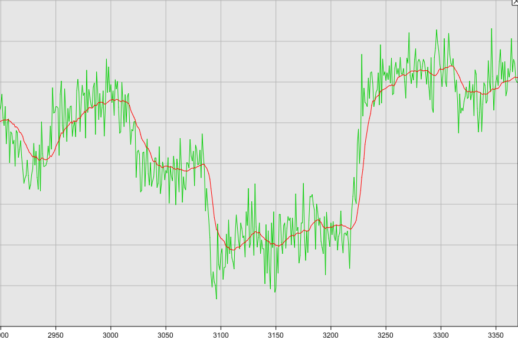

Forked from here: https://github.com/denyssene/SimpleKalmanFilter

It's just translated from C++ to Python. Examples have been removed.

Simple Kalman Filter Library Python - [](https://raw.githubusercontent.com/denyssene/SimpleKalmanFilter/master/LICENSE) [](https://github.com/denyssene/SimpleKalmanFilter/stargazers) [](https://github.com/denyssene/SimpleKalmanFilter/issues)
========================================

 

This is a basic kalman filter library for unidimensional models that you can use with a stream of single values like barometric sensors, temperature sensors or even gyroscope and accelerometers.

* Take a look at this [youtube video](https://www.youtube.com/watch?v=4Q5kJ96YYZ4) to see the Kalman Filter working on a stream of values!

*Special thanks to Professor Michel van Biezen and his amazing work in http://www.ilectureonline.com/*

Repository Contents
-------------------

* **/** - Source files for the library (SimpleKalmanFilter.py).

Basic Usage
-------------------
 * **e_mea: Measurement Uncertainty** - How much do we expect to our measurement vary 
 * **e_est: Estimation Uncertainty**  - Can be initilized with the same value as e_mea since the kalman filter will adjust its value.
 * **q: Process Variance** - usually a small number between 0.001 and 1 - how fast your measurement moves. Recommended 0.01. Should be tunned to your needs.
 
```python
import RPi.GPIO as GPIO

pin = 17 # as example you got sensor values from GPIO 17

GPIO.setmode(GPIO.BCM)
GPIO.setup(pin, GPIO.IN)

kf = SimpleKalmanFilter(e_mea, e_est, q);

while True:
 x = float(GPIO.input(pin)) # maybe you will calculate a range, a velocity or some other stuff instead of reading a value directly.
 estimated_x = kf.updateEstimate(x)
  
 # ...

``` 


Version History
---------------

* [V 0.1.0](https://github.com/denyssene/SimpleKalmanFilter) -- Initial commit


License Information
-------------------

This is an _**open source**_ project! 

Please review the LICENSE.md file for license information. 

If you have any questions or concerns on licensing, please contact denys.sene@gmail.com.
